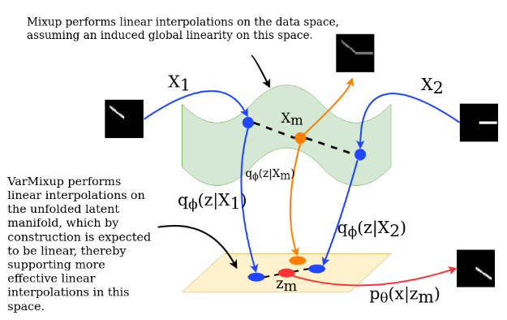
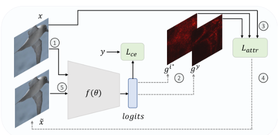
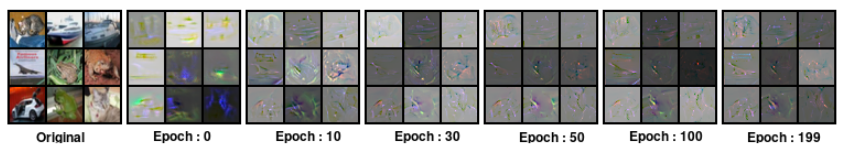
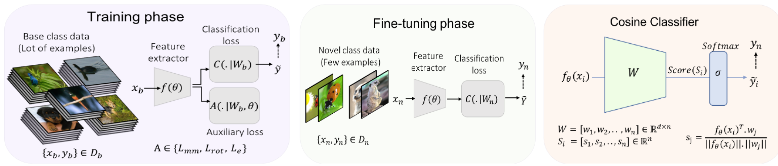
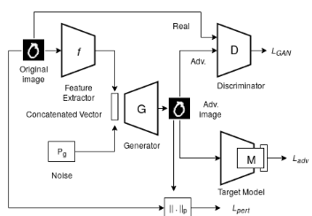
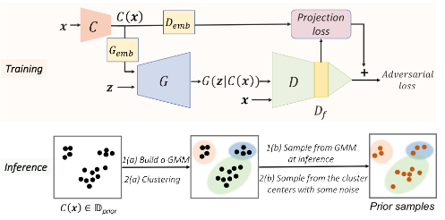

<head>

</head>

## 2021
<b><i> On the Benefits of Defining Vicinal Distributions in Latent Space</i></b> <a href="#" onclick="togglePopup('popup-1')"><b>[Abs]</b></a> <a href="https://arxiv.org/abs/2003.06566"><i class="fas fa-fw fa-file-pdf zoom" aria-hidden="true"></i></a> \
*Puneet Mangla, Vedant Singh, Shreyas Jayant Havaldar, Vineeth N Balasubramanian* \
<b>Best Paper Award</b> at ***Workshop on Adversarial Machine Learning, CVPR 2021*** \
<i>(Also accepted at RobustML Workshop, ICLR 2021 (Oral) and  Generalization Workshop, ICLR 2021)</i>

  

  

    
×

    
    
In this work, we investigate the benefits of defining these vicinal distributions like mixup in latent space of generative models rather than in input space itself. We propose a new approach - VarMixup (Variational Mixup) - to better sample mixup images by using the latent manifold underlying the data. Our empirical studies on CIFAR-10, CIFAR-100, and Tiny-ImageNet demonstrate that models trained by performing mixup in the latent manifold learned by VAEs are inherently more robust to various input corruptions/perturbations, are significantly better calibrated, and exhibit more local-linear loss landscapes.

  

 
## 2020
<b><i> Attributional Robustness Training using Input-Gradient Spatial Alignment</i></b> <a href="#" onclick="togglePopup('popup-2')"><b>[Abs]</b></a> <a href="https://arxiv.org/abs/1911.130736"><i class="fas fa-fw fa-file-pdf zoom" aria-hidden="true"></i></a> <a href="https://github.com/nupurkmr9/Attributional-Robustness"><i class="fab fa-fw fa-github zoom" aria-hidden="true"></i></a> \
*Mayank Singh, Nupur Kumari, Puneet Mangla, Abhishek Sinha, Vineeth N Balasubramanian, Balaji Krishnamurthy* \
Published in *Proceedings of European Conference on Computer Vision **(ECCV) 2020*** 

  

  

    
×

    
    
In this work, we study the problem of attributional robustness (ie models having robust explanations) by showing an upper bound for attributional vulnerability in terms of spatial correlation between the input image and its explanation map. We propose a training methodology that learns robust features by minimizing this upper bound using soft-margin triplet loss. Our methodology of robust attribution training (\textit {ART}) achieves the new state-of-the-art attributional robustness measure by a margin of 6-18 on several standard datasets, ie. SVHN, CIFAR-10 and GTSRB. We further show the utility of the proposed robust training technique (\textit {ART}) in the downstream task of weakly supervised object localization by achieving the new state-of-the-art performance on CUB-200 dataset.

  

 
<b><i> On Saliency Maps and Adversarial Robustness</i></b> <a href="#" onclick="togglePopup('popup-3')"><b>[Abs]</b></a> <a href="https://arxiv.org/abs/2006.07828"><i class="fas fa-fw fa-file-pdf zoom" aria-hidden="true"></i></a>  <a href="https://github.com/Puneet2000/SAT_ECML2020"><i class="fab fa-fw fa-github zoom" aria-hidden="true"></i></a> \
*Puneet Mangla, Vedant Singh, Vineeth N Balasubramanian* \
Published in *Proceedings of European Conference of Machine Learning and Principles and Practice of Knowledge Discovery in Databases **(ECML-PKDD) 2020*** 

  

  

    
×

    
    
In this work, we provide a different perspective to this coupling, and provide a method, Saliency based Adversarial training (SAT), to use saliency maps to improve adversarial robustness of a model. In particular, we show that using annotations such as bounding boxes and segmentation masks, already provided with a dataset, as weak saliency maps, suffices to improve adversarial robustness with no additional effort to generate the perturbations themselves. Our empirical results on CIFAR-10, CIFAR-100, Tiny ImageNet and Flower-17 datasets consistently corroborate our claim, by showing improved adversarial robustness using our method. saliency maps. We also show how using finer and stronger saliency maps leads to more robust models, and how integrating SAT with existing adversarial training methods, further boosts performance of these existing methods.

  

 
<b><i> Charting the Right Manifold: Manifold Mixup for Few-shot Learning</i></b> <a href="#" onclick="togglePopup('popup-4')"><b>[Abs]</b></a> <a href="https://arxiv.org/abs/1907.12087"><i class="fas fa-fw fa-file-pdf zoom" aria-hidden="true"></i></a> <a href="https://github.com/nupurkmr9/S2M2_fewshot"><i class="fab fa-fw fa-github zoom" aria-hidden="true"></i></a> \
*Puneet Mangla, Mayank Singh, Abhishek Sinha, Nupur Kumari, Vineeth N Balasubramanian, Balaji Krishnamurthy* \
Published in *Proceedings of IEEE Winter Conference on Applications of Computer Vision **(WACV) 2020*** \
(*Also accepted as spotlight at NeurIPS 2020 - MetaLearn Workshop*)

  

  

    
×

    
    
This work investigates the role of learning relevant feature manifold for few-shot tasks using self-supervision and regularization techniques. We observe that regularizing the feature manifold, enriched via self-supervised techniques, with Manifold Mixup significantly improves few-shot learning performance. We show that our proposed method S2M2 beats the current state-of-the-art accuracy on standard few-shot learning datasets like CIFAR-FS, CUB, mini-ImageNet and tiered-ImageNet by 3-8%. Through extensive experimentation, we show that the features learned using our approach generalize to complex few-shot evaluation tasks, cross-domain scenarios and are robust against slight changes to data distribution.

  

 
## 2019
<b><i> AdvGAN++ : Harnessing latent layers for adversary generation</i></b>  <a href="#" onclick="togglePopup('popup-5')"><b>[Abs]</b></a>  <a href="https://arxiv.org/abs/1908.00706"><i class="fas fa-fw fa-file-pdf zoom" aria-hidden="true"></i></a> \
*Puneet Mangla, Surgan Jandial, Sakshi Varshney, Vineeth N Balasubramanian* \
Published in *Proceedings of **Neural Architects Workshop, ICCV 2019*** 

  

  

    
×

    
    
In this work, we show how latent features can serve as better priors than input images for adversary generation by proposing AdvGAN++, a version of AdvGAN that achieves higher attack rates than AdvGAN and at the same time generates perceptually realistic images on MNIST and CIFAR-10 datasets.

  

 
# Preprints
<b><i> Data Instance Prior for Transfer Learning in GANs</i></b>  <a href="#" onclick="togglePopup('popup-6')"><b>[Abs]</b></a> <a href="(https://arxiv.org/abs/2012.04256"><i class="fas fa-fw fa-file-pdf zoom" aria-hidden="true"></i></a> \
*Puneet Mangla, Nupur Kumari, Mayank Singh, Vineeth N Balasubramanian, Balaji Krishnamurthy*

  

  

    
×

    
    
We propose a novel transfer learning method for GANs in the limited data domain by leveraging informative data prior derived from self-supervised/supervised pre-trained networks trained on a diverse source domain. We perform experiments on several standard vision datasets using various GAN architectures (BigGAN, SNGAN, StyleGAN2) to demonstrate that the proposed method effectively transfers knowledge to domains with few target images, outperforming existing state-of-the-art techniques in terms of image quality and diversity. We also show the utility of data instance prior in large-scale unconditional image generation and image editing tasks.

  

 